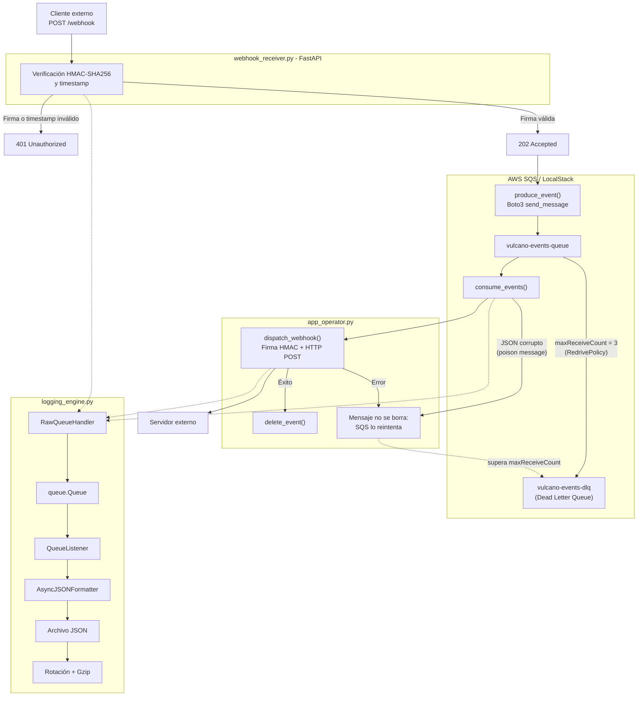

# Vulcano Engine

Sistema de procesamiento de eventos con Webhooks firmados mediante **HMAC-SHA256** y mensajería asíncrona sobre **AWS SQS**, emulada localmente mediante **LocalStack**.

El sistema incorpora validación de entradas, recepción de Webhooks, procesamiento mediante cola, despacho de eventos, manejo de excepciones y observabilidad no bloqueante mediante logs en formato JSON con rotación y compresión Gzip.

## Objetivo

La plataforma financiera **Vulcano Pay** necesita notificar eventos de pago a sistemas de terceros mediante Webhooks HTTP.

Para desacoplar la recepción de eventos de su posterior procesamiento, el sistema utiliza una cola SQS. De esta manera, el receptor puede aceptar rápidamente el evento y delegar su procesamiento al sistema de despacho.

La solución también incorpora:

- Validación de nombres de cola, tiempos de espera, URLs y claves secretas.
- Firma y verificación HMAC-SHA256.
- Protección contra timestamps inválidos o antiguos.
- Procesamiento de mensajes mediante SQS.
- Despacho de Webhooks hacia sistemas externos.
- Jerarquía de excepciones semánticas.
- Logging asíncrono en formato JSON.
- Registro estructurado de excepciones y causas encadenadas.
- Rotación y compresión Gzip de archivos de log.
- Dead Letter Queue (DLQ) para mensajes venenosos o no entregables.
- Pruebas automatizadas con `pytest` y `moto`.

## Estructura del proyecto

```text
vulcano_engine/
├── src/
│   ├── app_operator.py
│   └── vulcano_telemetry/
│       ├── __init__.py
│       ├── exceptions.py
│       ├── sanitizer.py
│       ├── core_sqs.py
│       ├── webhook_crypto.py
│       ├── webhook_receiver.py
│       └── logging_engine.py
│
├── infra/
│   └── setup_queues.py
│
├── tests/
│   ├── test_chaos.py
│   └── test_forensic_log.py
│
├── requirements.txt
└── README.md
```

### Responsabilidades principales

| Archivo | Responsabilidad |
|---|---|
| `exceptions.py` | Jerarquía de excepciones semánticas |
| `sanitizer.py` | Validación de entradas |
| `core_sqs.py` | Comunicación con SQS mediante Boto3 |
| `webhook_crypto.py` | Firma y verificación HMAC-SHA256 |
| `webhook_receiver.py` | Recepción de Webhooks mediante FastAPI |
| `logging_engine.py` | Logging JSON asíncrono, excepciones y rotación Gzip |
| `app_operator.py` | Interfaz de línea de comandos |
| `infra/setup_queues.py` | Crea `vulcano-events-queue`, `vulcano-events-dlq` y la `RedrivePolicy` |
| `test_chaos.py` | Pruebas de validadores y seguridad criptográfica |
| `test_forensic_log.py` | Pruebas de logging forense y rotación |

## Arquitectura



## Requisitos

- Python 3.11 o superior (el código usa `except*` y `add_note`). Desarrollado y probado con Python 3.14.
- Docker, para ejecutar LocalStack.
- Dependencias indicadas en `requirements.txt`.

## Instalación

### Crear el entorno virtual

En Windows:

```powershell
python -m venv .venv
```

Activar el entorno:

```powershell
.venv\Scripts\activate
```

Instalar las dependencias:

```powershell
pip install -r requirements.txt
```

> `requirements.txt` incluye `httpx2`, requerido por `starlette.testclient`
> (usado por `TestClient` de FastAPI en los tests).

## LocalStack

El proyecto utiliza LocalStack para emular AWS SQS localmente.

Iniciar LocalStack:

```bash
localstack start -d
```

El endpoint utilizado por defecto es:

```text
http://localhost:4566
```

### Crear las colas (paso obligatorio)

Antes de usar cualquier subcomando hay que aprovisionar las colas. Con
LocalStack levantado, ejecutar **una sola vez**:

```bash
python infra/setup_queues.py
```

El script crea:

| Recurso | Nombre | Detalle |
|---|---|---|
| Cola principal | `vulcano-events-queue` | `VisibilityTimeout=30`, con `RedrivePolicy` |
| Dead Letter Queue | `vulcano-events-dlq` | Destino de los mensajes que fallan |

Sin este paso los subcomandos fallan porque la cola no existe, y la cola
principal no derivaría nada a la DLQ.

## Dead Letter Queue (DLQ)

La DLQ evita que un mensaje que siempre falla bloquee el procesamiento
o se reintente indefinidamente.

1. El dispatcher recibe el mensaje con Long Polling. SQS lo oculta
   durante el `VisibilityTimeout` (30 s) e incrementa su contador de
   recepciones.
2. Solo si el webhook se entrega con éxito (respuesta HTTP < 400) se
   llama a `delete_message`.
3. Si la entrega falla, o si el cuerpo no es un JSON válido (*poison
   message*), el mensaje **no se borra**. `consume_events` registra el
   `CorruptedMessageError` en el log, omite ese mensaje y sigue con el
   resto del lote.
4. Tras el `VisibilityTimeout` SQS lo reentrega. Cuando el contador
   supera `maxReceiveCount` (3, definido en la `RedrivePolicy`), SQS lo
   mueve automáticamente a `vulcano-events-dlq`.

Para inspeccionar la DLQ:

```bash
aws --endpoint-url=http://localhost:4566 sqs receive-message \
    --queue-url http://localhost:4566/000000000000/vulcano-events-dlq \
    --max-number-of-messages 10 --region us-east-1
```

Los mensajes de la DLQ se analizan y se corrigen manualmente; no se
reprocesan de forma automática.

## Uso

### Mostrar la ayuda del CLI

```bash
python src/app_operator.py --help
```

El programa dispone de tres operaciones principales:

```text
produce-sqs
start-receiver
start-dispatcher
```

### Publicar un evento en SQS

```bash
python src/app_operator.py produce-sqs
```

El comando publica un evento de prueba en la cola configurada.

### Iniciar el receptor de Webhooks

```bash
python src/app_operator.py start-receiver
```

El receptor utiliza FastAPI y recibe eventos mediante HTTP.

Una solicitud válida obtiene una respuesta:

```text
202 Accepted
```

Una solicitud con firma o timestamp inválido es rechazada:

```text
401 Unauthorized
```

### Iniciar el dispatcher

```bash
python src/app_operator.py start-dispatcher
```

El dispatcher consume eventos de SQS y los envía mediante Webhooks firmados.

## Argumentos globales

| Argumento | Aplica a | Descripción | Valor por defecto |
|---|---|---|---|
| `--queue` | global | Nombre de la cola SQS | `vulcano-events-queue` |
| `--secret` | global | Clave secreta HMAC (mín. 16 caracteres) | Configurada por la aplicación |
| `--endpoint-url` | global | Endpoint de SQS / LocalStack | `http://localhost:4566` |
| `--host`, `--port` | `start-receiver` | Dirección y puerto del receptor | `0.0.0.0`, `8000` |
| `--target-url` | `start-dispatcher` | URL destino del webhook reenviado | `http://localhost:9000/incoming` |
| `--wait-time` | `start-dispatcher` | Long Polling, 1 a 20 s | `10` |
| `--max-iterations` | `start-dispatcher` | Ciclos de polling y termina (pruebas) | sin límite |

### Validación de entradas

Los nombres de cola deben respetar el formato:

```text
vulcano-<nombre>-queue
```

Los tiempos de espera admitidos están entre:

```text
1 y 20 segundos
```

Las claves secretas deben tener como mínimo:

```text
16 caracteres
```

Las URLs aceptadas utilizan los esquemas:

```text
http://
https://
```

## Seguridad HMAC

Los Webhooks utilizan **HMAC-SHA256** para verificar la autenticidad del mensaje.

La firma se calcula utilizando los **bytes originales del cuerpo HTTP**.

La comparación de firmas utiliza:

```python
hmac.compare_digest()
```

para realizar una comparación resistente a ataques basados en diferencias de tiempo.

Además, el receptor valida el timestamp incluido en la solicitud para evitar ataques de repetición (*replay attacks*).

## Manejo de excepciones

El sistema posee una jerarquía de excepciones propia:

```text
VulcanoError
├── SQSConnectionError
├── QueueTimeoutError
├── CorruptedMessageError
├── WebhookSignatureError
├── WebhookTimestampError
└── WebhookDeliveryError
```

Todas las excepciones del dominio heredan de `Exception`.

## Logging y observabilidad

El sistema utiliza un pipeline de logging asíncrono:

```text
LogRecord
    ↓
RawQueueHandler
    ↓
queue.Queue
    ↓
QueueListener
    ↓
AsyncJSONFormatter
    ↓
Archivo JSON
    ↓
Rotación
    ↓
Gzip
```

El logging registra información como:

- Timestamp UTC.
- Nivel del log.
- Nombre del logger.
- Mensaje.
- Proceso.
- Hilo.
- `event_id`.
- `queue_name`.
- `message_id`.
- `indice`, cuando corresponde.

El logger se llama `vulcano_engine` y es el mismo que usan `core_sqs.py` y
`webhook_receiver.py`, por lo que todos sus mensajes llegan al archivo
`vulcano.log`.

### Rotación y compresión

- El archivo rota al llegar a 2 MB.
- Se conservan 3 respaldos comprimidos: `vulcano.log.1.gz`, `vulcano.log.2.gz` y `vulcano.log.3.gz`.
- La compresión escribe primero un archivo temporal y luego lo renombra, para no dejar archivos `.gz` incompletos.

### Excepciones en el log

Las excepciones se almacenan de forma estructurada, incluyendo:

- Tipo de excepción.
- Mensaje.
- Traceback.
- Causa encadenada mediante `caused_by`.
- Sub-excepciones de `ExceptionGroup`.

## Escenarios de prueba

### Escenario A — Operación nominal

Un Webhook con firma válida es recibido y aceptado:

```text
202 Accepted
```

El evento se publica en SQS y posteriormente el dispatcher lo envía al destino configurado.

Cuando el envío es exitoso, el mensaje se elimina de la cola.

### Escenario B — Validación de entradas

Se prueban valores inválidos para:

- Nombre de cola.
- Tiempo de espera.
- URL.
- Clave secreta.

Los valores inválidos son rechazados antes de realizar operaciones de red.

### Escenario C — Seguridad criptográfica

Se prueban:

- Firma HMAC alterada.
- Timestamp antiguo.
- Firma válida.

Las firmas alteradas y timestamps inválidos son rechazados.

### Escenario D — Logging forense

Se verifica:

- Formato JSON.
- Timestamp ISO-8601 UTC.
- Campos obligatorios.
- Información de proceso e hilo.
- Excepciones.
- Causas encadenadas.
- `ExceptionGroup`.
- Rotación.
- Compresión Gzip.

## Tests

Ejecutar todos los tests:

```bash
python -m pytest tests/ -v
```

Los tests utilizan `moto` para simular los servicios de AWS necesarios durante las pruebas, evitando depender de una instancia real de AWS.

## Reglas de diseño

- Todas las excepciones del dominio heredan de `Exception`.
- No se utilizan `return`, `break` ni `continue` dentro de bloques `finally`.
- La verificación HMAC se realiza sobre los bytes originales del cuerpo HTTP.
- Se utiliza `hmac.compare_digest()` para comparar firmas.
- El logging utiliza un pipeline asíncrono mediante `QueueHandler`, `queue.Queue` y `QueueListener`.
- Las excepciones se conservan y serializan estructuradamente.
- Al rotar, los logs se comprimen en Gzip de forma atómica mediante los callbacks `namer` y `rotator` de `RotatingFileHandler`.
- Las entradas recibidas por el CLI son validadas antes de utilizarse.

## Estado del proyecto

La suite se ejecuta con `python -m pytest tests/ -v`. Cubre:

- Validación de entradas.
- Mensajes venenosos sin pérdida del resto del lote.
- Manejo de excepciones.
- HMAC-SHA256.
- Protección contra replay attacks.
- SQS.
- Webhooks.
- Dispatcher.
- Logging JSON.
- Excepciones encadenadas.
- `ExceptionGroup`.
- Rotación y compresión Gzip.